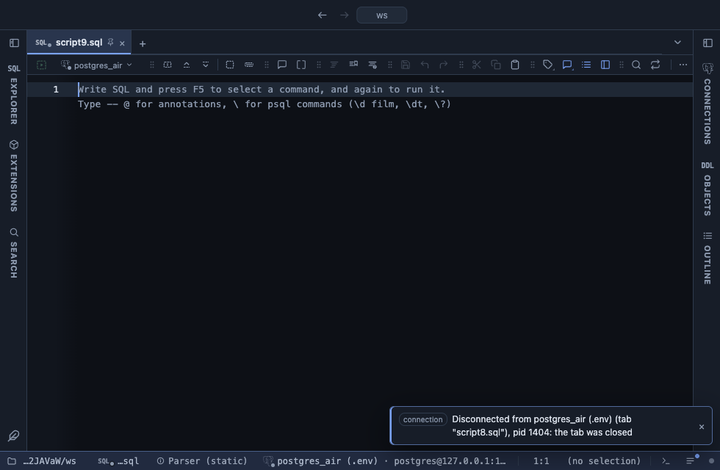

# Treemap

Nested rectangles sized by a value, over one or more hierarchy levels: continent, then country, then city. Click a rectangle to drill into it, and the breadcrumb below walks back up. Drawn with Apache ECharts, pulled from a CDN.

## What it shows

A **Treemap** tab beside the grid. Every distinct path of level values is a rectangle sized by its folded value (a sum, a mean or a count of its rows), grouped inside its parent level, which carries its name in a header strip. Each rectangle is labelled with its name and value. Deep trees show two levels at a time. Up to 5000 rectangles, the largest; the rest, and any with a zero or negative value, are left out and counted in the Log. A header button copies the leaves with their values as CSV.

## Inputs

| Input | `@inputs` key | Default | Meaning |
|---|---|---|---|
| Levels (outer first) | `path` | every text column | One column per hierarchy level, the outermost first: continent, country |
| Value | `value` | none | Numeric column folded into each rectangle; without one, a count of rows |
| Fold | `agg` | sum | How the rows of one rectangle combine |
| Title | `title` | none |  |

## Requirements

PostgreSQL 13 or newer. No server side: the result's sandbox draws it from the rows already fetched. ECharts comes from `cdn.jsdelivr.net` when the view draws, so that host has to be allowed first; the extension's page has the Allow button. Brings the Stats core extension along: the shared helpers that read the rows.

## Notes

A parent's area is always the total of its children, whatever the fold, since that is what an area can show; with mean the labels on the leaves are the means. From a script: `-- @extension treemap` (plus `open`, `only` or `beside` for how the view opens) above the query, and `-- @inputs` to answer the inputs in the file so the dialog never shows. From a result: its own menu. The page has every line ready.
