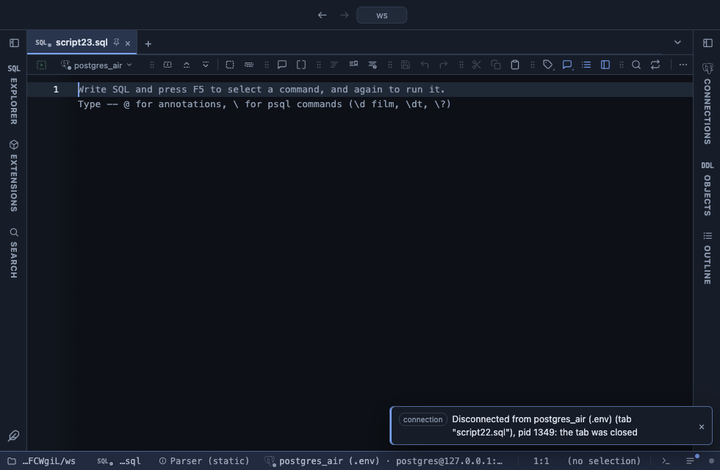

# Waterfall

How a start turns into an end, one step at a time: each row is a bar that floats from where the previous one ended, green when it adds and red when it takes away, with a Total bar at the end. Drawn with Apache ECharts, pulled from a CDN.

## What it shows

A **Waterfall** tab beside the grid, one bar per row in the result's order. Each bar is labelled with its step (`+120`, `-45`), the tooltip adds the running total, and the Total bar, in the accent colour, reaches from zero to where the steps end. A step that crosses zero is drawn whole, part above and part below the axis. Up to 500 bars; the rest are left out and the Log says how many. A header button copies the steps and the running totals as CSV.

## Inputs

| Input | `@inputs` key | Default | Meaning |
|---|---|---|---|
| Category (one bar per row) | `category` | asked | The label under each bar |
| Step | `value` | asked | The change each row makes to the running total, up or down |
| Total bar | `total` | yes | A last bar from zero to where the steps end |
| Title | `title` | none |  |

## Requirements

PostgreSQL 13 or newer. No server side: the result's sandbox draws it from the rows already fetched. ECharts comes from `cdn.jsdelivr.net` when the view draws, so that host has to be allowed first; the extension's page has the Allow button. Brings the Stats core extension along: the shared helpers that read the rows.

## Notes

The first row is usually the starting balance and the rest the changes, in the order the query returns them: sort in SQL. Rows without a numeric step are skipped and counted in the Log. From a script: `-- @extension waterfall` (plus `open`, `only` or `beside` for how the view opens) above the query, and `-- @inputs` to answer the inputs in the file so the dialog never shows. From a result: its own menu. The page has every line ready.
