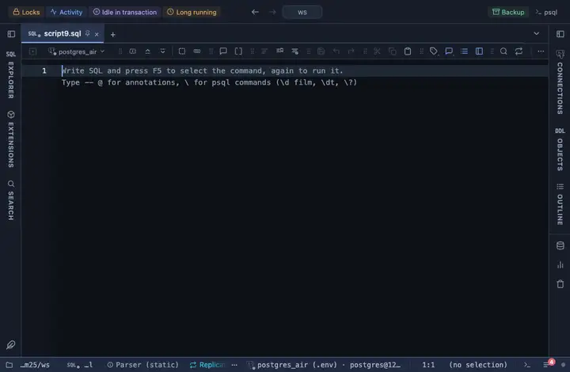

# European dates

Every date and timestamp column reads the European way, 23.09.2026 11:15, the server value on hover.

## What it shows

A formatting rule that matches every DATE and TIMESTAMP column (with or without time zone), whatever its name. The cell reads the day first, the month, then the year, with dots, and a 24-hour clock (`23.09.2026 11:15`); the slash of the British and French forms is one edit in the file. A DATE column is read as the calendar day it names (never slid a day by a time zone), a naive timestamp as local time, a timestamptz in the viewer's zone; the exact server text is in the tooltip. The raw value is untouched: copy, export and the console still take what the server sent.

## Requirements

PostgreSQL 13 or newer. Nothing on the server: the rule runs in the grid.

## Notes

Attach it from a script with `-- @extension date-european` above a query (or in the file header for every query), or from a result's own menu; the extension's page in PlumeSQL lists the lines to paste. The pattern and the format are in the file: fork it (the row menu's Fork) to narrow it to some columns (`match: { name: /_at$/, type: /^timestamp/ }`) or to change the form.
