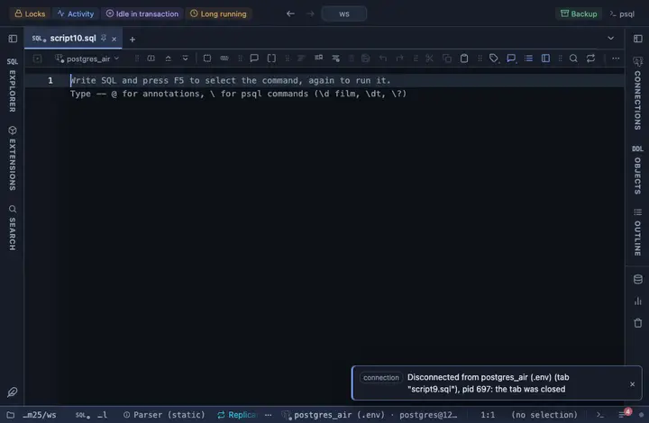

# ISO dates

Every date and timestamp column reads as 2026-09-23 11:15:03, local time, no fraction and no zone, the server value on hover.

## What it shows

One rule for every DATE and TIMESTAMP column in the result, with or without a time zone and whatever the column is called. The cell reads the SQL form (`2026-09-23 11:15:03`) in the viewer's local time, the fraction of a second and the zone offset dropped from the cell and kept in the tooltip. A DATE value stays the day it names, whatever the zone; a timestamp without zone is taken as local time and a timestamptz is shifted into the viewer's zone. Hover for the server's exact text. Only the cell changes; a copy, an export and the console still carry the server's own text.

## Requirements

PostgreSQL 13 or newer. Runs in the grid alone, nothing is sent to the server.

## Notes

To use it, put `-- @extension date-iso` above a query (in the file header it covers every query in the file) or pick it from a result's own menu. The lines to paste are on the extension's page. Fork it from the row menu to limit it to some columns (a `match` such as `{ name: /_at$/, type: /^timestamp/ }`) or to change the format; both sit at the top of the file.
