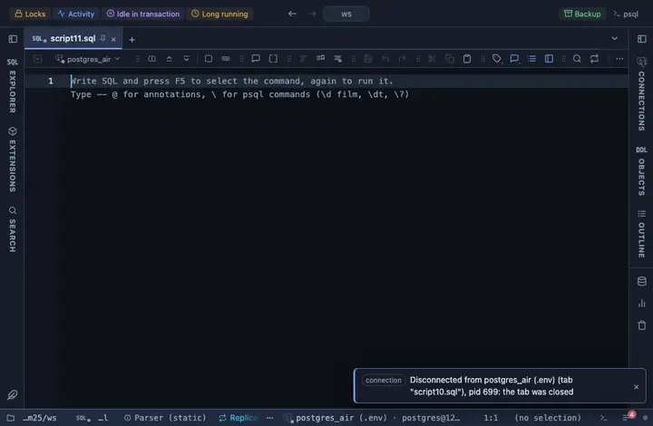

# Local dates

Every date and timestamp column reads in the viewer's own locale and clock, the server value on hover.

## What it shows

Every column of type DATE or TIMESTAMP (either flavour) gets the rule, by type alone; the name plays no part. The cell reads whatever the viewer's browser or desktop locale says: `9/23/2026, 11:15 AM` under a US locale, `23.9.2026, 11:15` under a German one, `23/09/2026, 11:15` under a British one. Dates are never slid by a time zone (a DATE is read as its calendar day); naive timestamps read as local time, timestamptz values in the viewer's zone, and the tooltip keeps what the server sent. What the server sent stays the value: copying, exporting and the console never see the formatted text.

## Requirements

PostgreSQL 13 or newer. The rule works on the result in the grid; the server is never asked.

## Notes

A script attaches it with `-- @extension date-locale` above the query, or once in the header for the whole file; a result's menu can attach it too. The extension's page lists the exact lines. Want it on `_at` columns only, or in another form? Fork (row menu) and edit the `match` (`{ name: /_at$/, type: /^timestamp/ }`) or the format in the file.
