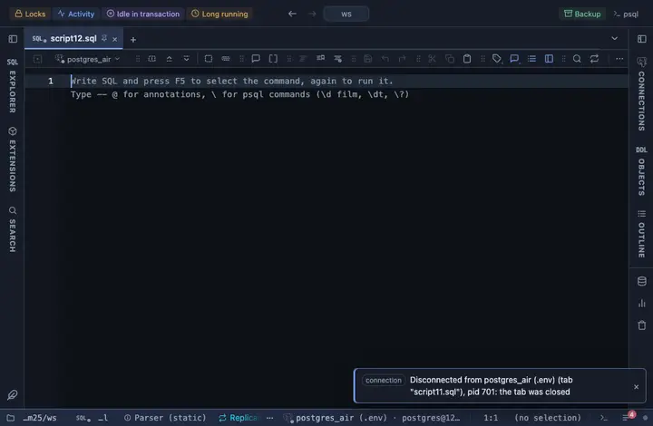

# Long dates

Every date and timestamp column reads as a long date, September 23, 2026, 11:15 AM, the server value on hover.

## What it shows

The rule keys on the type, not the name: any DATE, TIMESTAMP or TIMESTAMPTZ column reads this way. The cell reads the month spelled out (`September 23, 2026`), a timestamp adding a 12-hour clock (`September 23, 2026, 11:15 AM`). The day of a DATE column is kept as written, a naive timestamp is local time, a timestamptz lands in the viewer's zone; the original text is one hover away. The formatting is a reading of the cell, not a change to it, so copy, export and the console keep the raw value.

## Requirements

PostgreSQL 13 or newer. No server side at all: the grid applies the rule to what it already has.

## Notes

Write `-- @extension date-long` above a query, or in the file header for all of them, or attach it from the result's menu; the page in PlumeSQL has the lines ready to copy. The match and the format are the file's first lines: fork it (row menu) to narrow the columns (`match: { name: /_at$/, type: /^timestamp/ }`) or to reshape the output.
