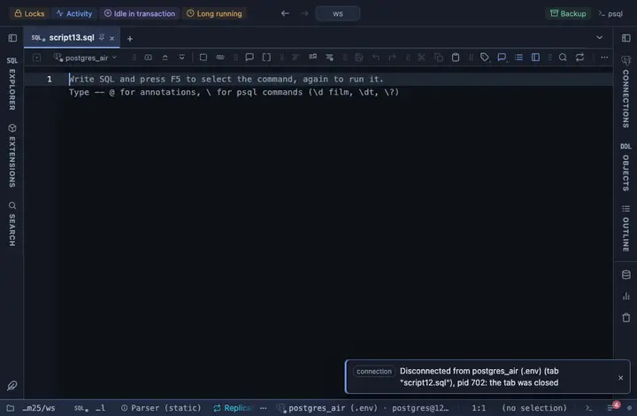

# Date only

A timestamp column named *_at shows just the date, dropping the time.

## What it shows

A formatting rule that matches a TIMESTAMP column (with or without time zone) whose name ends in `_at` (created_at, updated_at); the match ANDs the name and the type. The cell reads the date alone (`2026-09-22`). The raw value is untouched: copy, export and the console still take what the server sent.

## Requirements

PostgreSQL 13 or newer. Nothing on the server: the rule runs in the grid.

## Notes

Attach it from a script with `-- @extension date-only` above a query (or in the file header for every query), or from a result's own menu; the extension's page in PlumeSQL lists the lines to paste. The pattern and the words are in the file: fork it (the row menu's Fork) to change them to your own vocabulary.
