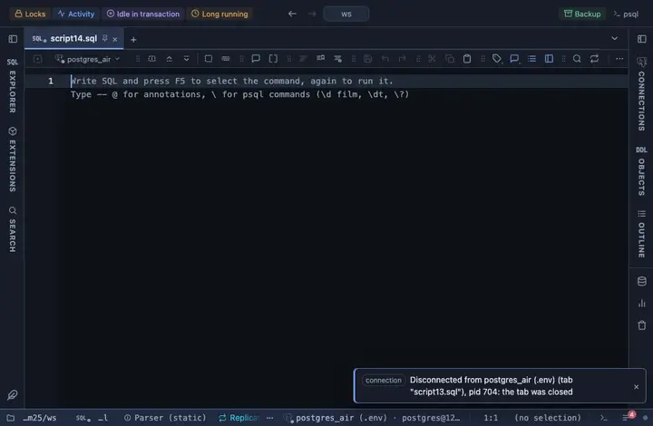

# Short dates

Every date and timestamp column reads as a short date, Sep 23, 2026, 11:15 AM, the server value on hover.

## What it shows

A formatting rule that matches every DATE and TIMESTAMP column (with or without time zone), whatever its name. The cell reads the month abbreviated in words (`Sep 23, 2026`), a timestamp adding a 12-hour clock (`Sep 23, 2026, 11:15 AM`). A DATE column is read as the calendar day it names (never slid a day by a time zone), a naive timestamp as local time, a timestamptz in the viewer's zone; the exact server text is in the tooltip. Only the cell changes; a copy, an export and the console still carry the server's own text.

## Requirements

PostgreSQL 13 or newer. Runs in the grid alone, nothing is sent to the server.

## Notes

To use it, put `-- @extension date-short` above a query (in the file header it covers every query in the file) or pick it from a result's own menu. The lines to paste are on the extension's page. The pattern and the format are in the file: fork it (the row menu's Fork) to narrow it to some columns (`match: { name: /_at$/, type: /^timestamp/ }`) or to change the form.
