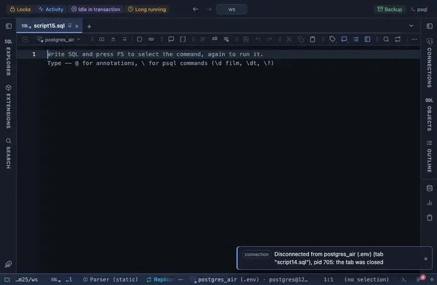

# US dates

Every date and timestamp column reads the US way, 9/23/2026, 11:15 AM, the server value on hover.

## What it shows

One rule for every DATE and TIMESTAMP column in the result, with or without a time zone and whatever the column is called. The cell reads the month first, the day, then the year, and a 12-hour clock (`9/23/2026, 11:15 AM`). A DATE value stays the day it names, whatever the zone; a timestamp without zone is taken as local time and a timestamptz is shifted into the viewer's zone. Hover for the server's exact text. What the server sent stays the value: copying, exporting and the console never see the formatted text.

## Requirements

PostgreSQL 13 or newer. The rule works on the result in the grid; the server is never asked.

## Notes

A script attaches it with `-- @extension date-us` above the query, or once in the header for the whole file; a result's menu can attach it too. The extension's page lists the exact lines. Fork it from the row menu to limit it to some columns (a `match` such as `{ name: /_at$/, type: /^timestamp/ }`) or to change the format; both sit at the top of the file.
