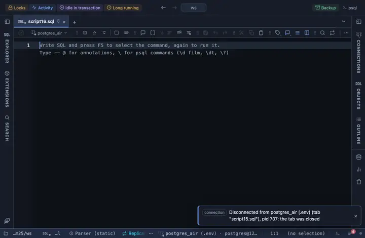

# Dates with the weekday

Every date and timestamp column reads with its weekday, Tuesday, September 23, 2026, the server value on hover.

## What it shows

Every column of type DATE or TIMESTAMP (either flavour) gets the rule, by type alone; the name plays no part. The cell reads the weekday and the month spelled out (`Tuesday, September 23, 2026`), a timestamp adding a 12-hour clock. Dates are never slid by a time zone (a DATE is read as its calendar day); naive timestamps read as local time, timestamptz values in the viewer's zone, and the tooltip keeps what the server sent. The formatting is a reading of the cell, not a change to it, so copy, export and the console keep the raw value.

## Requirements

PostgreSQL 13 or newer. No server side at all: the grid applies the rule to what it already has.

## Notes

Write `-- @extension date-weekday` above a query, or in the file header for all of them, or attach it from the result's menu; the page in PlumeSQL has the lines ready to copy. Want it on `_at` columns only, or in another form? Fork (row menu) and edit the `match` (`{ name: /_at$/, type: /^timestamp/ }`) or the format in the file.
