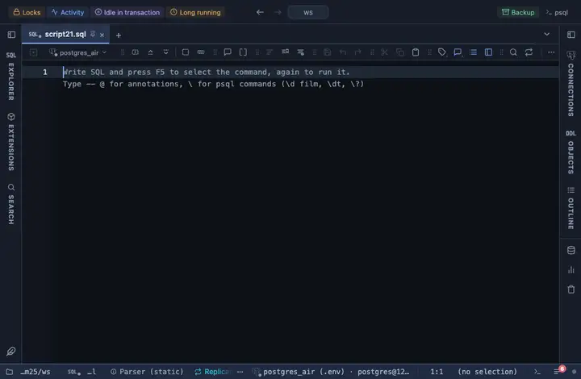

# Local time

A timestamptz column reads in the viewer's local time and format, the server's value on hover.

## What it shows

A formatting rule that matches every `timestamp with time zone` column. The cell reads in the viewer's own zone and locale (`22/09/2026, 15:24:52`), whatever the session's zone was; the server's exact text is in the tooltip. The hours-only offset PostgreSQL prints (`+02`) is padded to `+02:00` so the browser accepts it. The raw value is untouched: copy, export and the console still take what the server sent.

## Requirements

PostgreSQL 13 or newer. Nothing on the server: the rule runs in the grid.

## Notes

Attach it from a script with `-- @extension local-time` above a query (or in the file header for every query), or from a result's own menu; the extension's page in PlumeSQL lists the lines to paste. Both the column pattern and the wording sit at the top of the file; Fork in the row menu gives you a copy to adjust.
