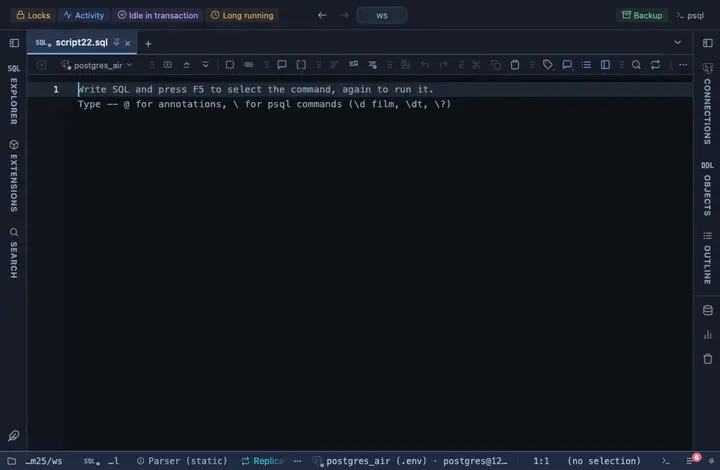

# Month and year

Every date and timestamp column reads as its month and year, Sep 2026, the day on hover.

## What it shows

The rule keys on the type, not the name: any DATE, TIMESTAMP or TIMESTAMPTZ column reads this way. The cell reads the month abbreviated and the year alone (`Sep 2026`), the day and the time dropped: for a report read by period. The day of a DATE column is kept as written, a naive timestamp is local time, a timestamptz lands in the viewer's zone; the original text is one hover away. Only the cell changes; a copy, an export and the console still carry the server's own text.

## Requirements

PostgreSQL 13 or newer. Runs in the grid alone, nothing is sent to the server.

## Notes

To use it, put `-- @extension month-year` above a query (in the file header it covers every query in the file) or pick it from a result's own menu. The lines to paste are on the extension's page. The match and the format are the file's first lines: fork it (row menu) to narrow the columns (`match: { name: /_at$/, type: /^timestamp/ }`) or to reshape the output.
