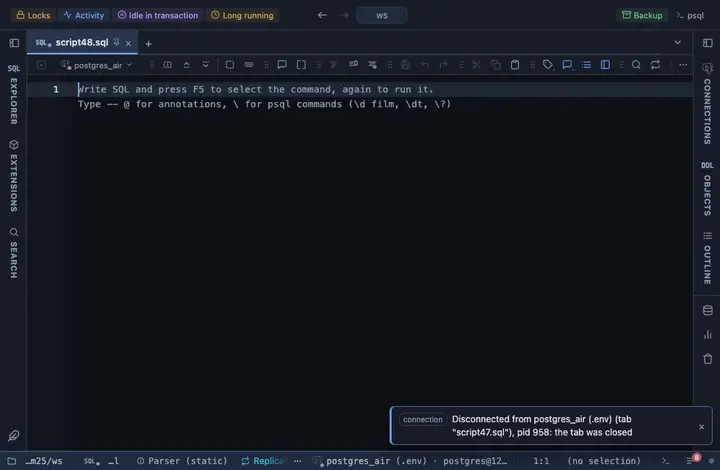

# Time only

Every timestamp column shows just the clock, 11:15:03, the date on hover.

## What it shows

A formatting rule that matches a TIMESTAMP column (with or without time zone), whatever its name. The cell reads the clock alone (`11:15:03`) in the viewer's local time, the date kept in the tooltip: for a log of one day. A DATE column is read as the calendar day it names (never slid a day by a time zone), a naive timestamp as local time, a timestamptz in the viewer's zone; the exact server text is in the tooltip. The formatting is a reading of the cell, not a change to it, so copy, export and the console keep the raw value.

## Requirements

PostgreSQL 13 or newer. No server side at all: the grid applies the rule to what it already has.

## Notes

Write `-- @extension time-only` above a query, or in the file header for all of them, or attach it from the result's menu; the page in PlumeSQL has the lines ready to copy. The pattern and the format are in the file: fork it (the row menu's Fork) to narrow it to some columns (`match: { name: /_at$/, type: /^timestamp/ }`) or to change the form.
