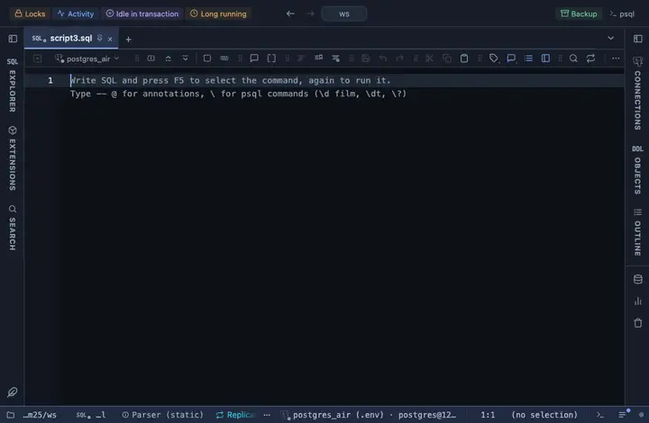

# Amount USD

A numeric column named amount, price, cost, total, balance or salary reads as a USD amount, right aligned.

## What it shows

A formatting rule that matches a NUMBER column whose name ends in amount, price, cost, total, balance or salary (case insensitive); the match ANDs the name and a numeric type, so a text column named cost_note, or a number not named like money, is left alone. The cell reads as currency in the viewer's locale (`$1,234.50`). The raw value is untouched: copy, export and the console still take what the server sent.

## Requirements

PostgreSQL 13 or newer. Nothing on the server: the rule runs in the grid.

## Notes

Attach it from a script with `-- @extension amount-usd` above a query (or in the file header for every query), or from a result's own menu; the extension's page in PlumeSQL lists the lines to paste. The file is short and the pattern and words are the first thing in it: Fork (row menu) and change them to taste. Change the currency code in the file for another currency.
