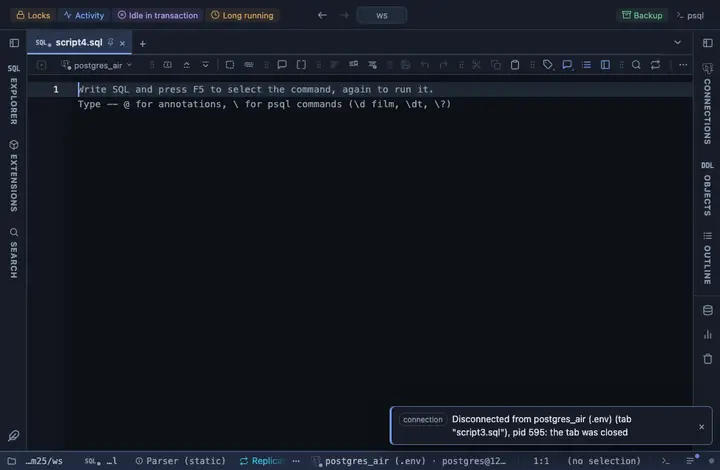

# Arrays

An array column reads as its items separated by commas instead of PostgreSQL's `{a,b,"c d"}` literal, with the item count on hover.

## What it shows

A formatting rule that matches every ARRAY column, whatever the element type (text[], integer[] and so on). The literal is parsed the way PostgreSQL writes it (items split on commas outside quotes, quotes and backslashes unescaped), a NULL item reads as ∅, an empty array as `[]`, and the count is in the tooltip. Only the cell changes; a copy, an export and the console still carry the server's own text.

## Requirements

PostgreSQL 13 or newer. Runs in the grid alone, nothing is sent to the server.

## Notes

To use it, put `-- @extension arrays` above a query (in the file header it covers every query in the file) or pick it from a result's own menu. The lines to paste are on the extension's page. The pattern and the words are in the file: fork it (the row menu's Fork) to change them to your own vocabulary.
