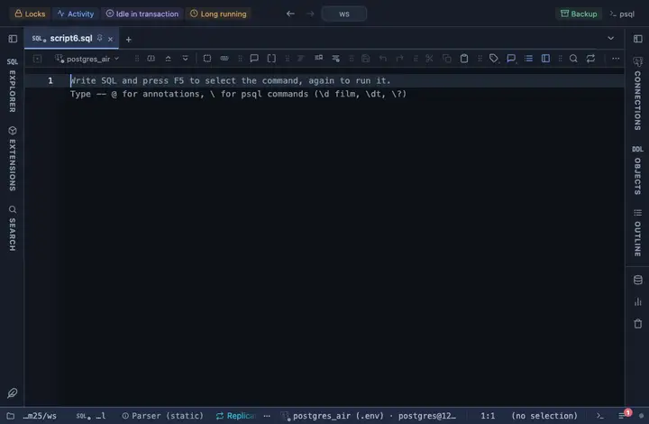

# Booleans

Every boolean column reads a green Yes or a red No.

## What it shows

A formatting rule that matches every boolean column by type. The server's `t` and `f` read Yes and No, coloured. What the server sent stays the value: copying, exporting and the console never see the formatted text.

## Requirements

PostgreSQL 13 or newer. The rule works on the result in the grid; the server is never asked.

## Notes

A script attaches it with `-- @extension booleans` above the query, or once in the header for the whole file; a result's menu can attach it too. The extension's page lists the exact lines. Both the column pattern and the wording sit at the top of the file; Fork in the row menu gives you a copy to adjust.
