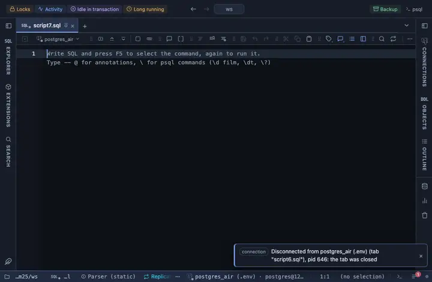

# Byte sizes

A numeric column named *size or *bytes reads as KB, MB, GB.

## What it shows

A formatting rule that matches a NUMBER column whose name ends in size or bytes; the match ANDs the name and a numeric type, so a text column is left alone. The cell reads as a human size (`1.5 MB`), right aligned. The formatting is a reading of the cell, not a change to it, so copy, export and the console keep the raw value.

## Requirements

PostgreSQL 13 or newer. No server side at all: the grid applies the rule to what it already has.

## Notes

Write `-- @extension byte-sizes` above a query, or in the file header for all of them, or attach it from the result's menu; the page in PlumeSQL has the lines ready to copy. To match other columns or say it differently, fork it from the row menu and edit the pattern and the words in the file.
