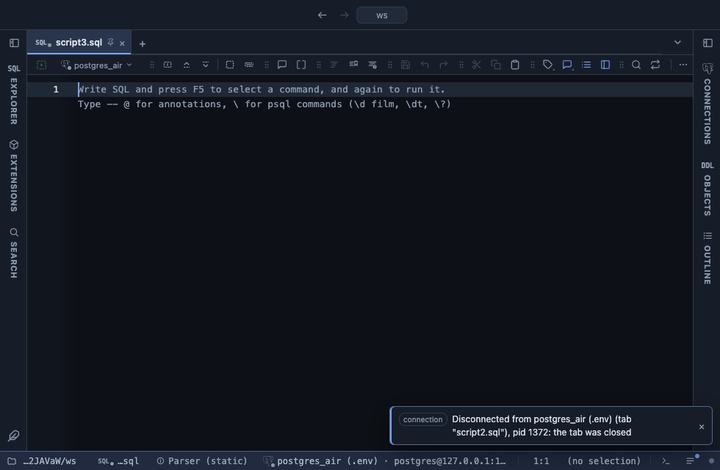

# Conditional format

Colour scales, data bars, icon sets and highlights on chosen columns, like a spreadsheet's Conditional Formatting, over the whole result.

## What it shows

A **Conditional format** tab beside the grid, itself a grid: every column and row of the result in its order, with the chosen columns painted by one style. Each cell keeps its original value, so copy, filter and export read the data, not the paint. Every colour comes from the theme, so a theme extension repaints it too.

- **color scale**: the low end in one colour, the high end in the other, the middle close to the ground (red-green, the default, puts the high end in green as a spreadsheet does; green-red turns it round; accent runs from faint to strong).
- **data bars**: a bar behind the number, its length the value's share of the largest absolute value; negatives are red.
- **icon set**: ▲ green for the top third of the values, ● amber for the middle, ▼ red for the bottom third.
- **top 10** and **bottom 10**: the N largest or smallest values highlighted; ties at the edge are all in.
- **above average** and **below average**: values above or below the column's mean highlighted.
- **duplicates**: values that appear more than once highlighted; this one works on text columns too.

Thresholds read every row the view reads, and each column is judged on its own.

## Inputs

| Input | `@inputs` key | Default | Meaning |
|---|---|---|---|
| Columns | `columns` | every column | Columns to format; the numeric styles skip a column that is not numeric |
| Style | `style` | color scale | The rule that paints the cells |
| Colours | `scheme` | red-green | For a colour scale: the low end first, then the high end |
| N | `n` | 10 | For top 10 and bottom 10: how many values are highlighted |

## Requirements

PostgreSQL 13 or newer. No server side: the result's sandbox computes it from the rows already fetched.

## Notes

A numeric style on a text column leaves it alone and says so in the Log. The grid lists the first 100,000 rows. From a script: `-- @extension conditional-format` above the query, and `-- @inputs columns=sales, margin, style=data bars` to answer the inputs in the file. It chains after another table view, so a pivot can read as a heatmap: `-- @extension pivot | conditional-format`.

To colour the result itself, cell by cell against one condition, use **Highlight**: it formats the grid in place instead of opening a tab.
