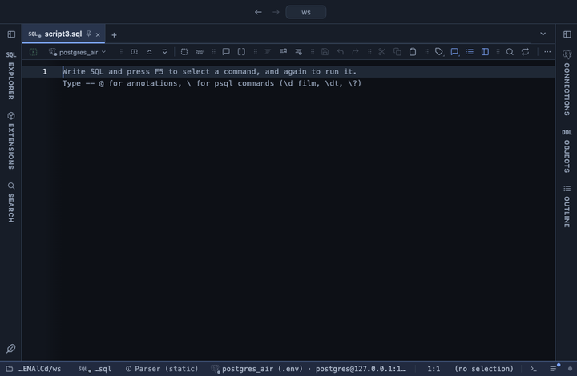

# Currency

Amount columns read as money: the currency, the way of writing it and the columns are yours to pick, negatives in parentheses if you like.

## What it shows

The columns you pick read with the currency and grouping you chose: `1.234,56 €`, `€1,234.56`, `CHF 1’234.56` and so on, right aligned, a negative in red. The accounting style writes a negative in parentheses and a zero as a dash, with the digits of every row lined up. A `money` column is read in the server's own shape first, so it works whatever `lc_monetary` says. Hover a cell for the server's exact value; a copy, an export and the console still carry it.

## Choosing

| Input | What it decides | Default |
|---|---|---|
| Columns | the amount columns | amount, price, cost, total, balance, salary, fee (the ones the result has) |
| Currency | the ISO code; empty for a plain number with two decimals | EUR |
| Written | the grouping and where the symbol goes | your locale |
| Negatives | with a minus, or in parentheses (accounting) | with a minus |

Change the answers any time from the result's menu (Configure Currency), or keep them with a script: `-- @inputs columns=price, total, currency=USD` above the query.

## Requirements

PostgreSQL 13 or newer. Runs in the grid alone, nothing is sent to the server.

## Notes

To use it, put `-- @extension currency` above a query or pick it from a result's own menu. It replaces the euro, dollar and accounting formatters the marketplace carried before.
