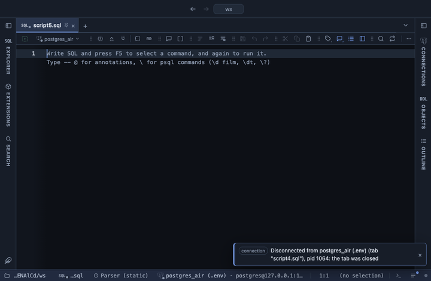

# Date format

Every date and timestamp column reads in the format you pick: ISO, European, US, long, short, weekday, month and year, date only, time only or your own locale. The server's exact value stays on hover.

## What it shows

One rule for every DATE and TIMESTAMP column in the result, with or without a time zone and whatever the column is called. A DATE value reads as its day alone and stays the day it names, whatever the zone; a timestamp adds its time, a timestamp without zone taken as local time and a timestamptz shifted into the viewer's zone.

| Format | A timestamp reads |
|---|---|
| ISO | 2026-09-23 11:15:03 |
| European | 23.09.2026 11:15 |
| US | 9/23/2026, 11:15 AM |
| Long | September 23, 2026 at 11:15 AM |
| Short | Sep 23, 2026, 11:15 AM |
| Weekday | Wednesday, September 23, 2026 at 11:15 AM |
| Month and year | Sep 2026 |
| Date only | 2026-09-23 |
| Time only | 11:15:03 |
| Your locale | the viewer's own locale and clock |

Only the cell changes; a copy, an export and the console still carry the server's own text.

## Choosing the format

The first time the extension applies to a result it asks for the format, ISO unless you pick another; change it any time from the result's menu (Configure Date format). To keep a format with a script, put it on the line: `-- @inputs format=European, 23.09.2026 11:15` above the query or in the file header.

## Requirements

PostgreSQL 13 or newer. Runs in the grid alone, nothing is sent to the server.

## Notes

To use it, put `-- @extension date-format` above a query (in the file header it covers every query in the file) or pick it from a result's own menu. It replaces the separate date formatters (ISO, European, US, long, short, weekday, month and year, date only, time only, locale and local time) that the marketplace carried before; Time ago stays its own extension.
