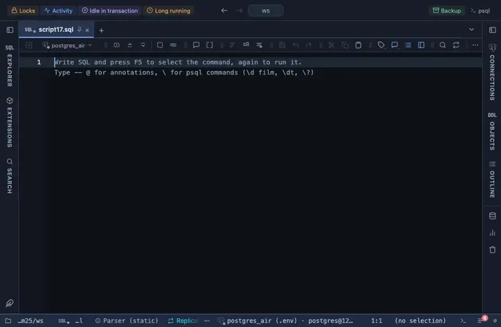

# Duration

A numeric column holding milliseconds reads as a duration a human can compare at a glance: 123.4 ms, 1.2 s, 4m 12s, 2h 05m, 3d 4h.

## What it shows

A formatting rule that matches a NUMBER column whose name ends in `_ms`, `_time`, duration, elapsed or latency (pg_stat_statements' total_exec_time and mean_exec_time among them); the match ANDs the name and a numeric type, so a timestamp named start_time is left alone. The exact number of milliseconds stays in the tooltip. The raw value is untouched: copy, export and the console still take what the server sent.

## Requirements

PostgreSQL 13 or newer. Nothing on the server: the rule runs in the grid.

## Notes

Attach it from a script with `-- @extension duration` above a query (or in the file header for every query), or from a result's own menu; the extension's page in PlumeSQL lists the lines to paste. The file is short and the pattern and words are the first thing in it: Fork (row menu) and change them to taste.
