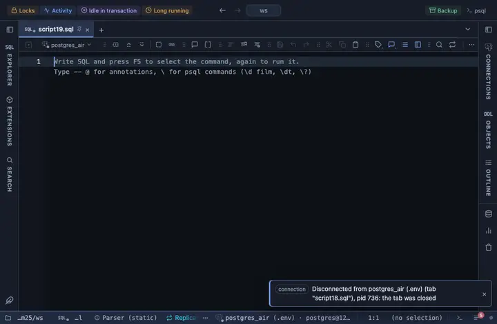

# Full name

Adds a computed `name` column joining first_name and last_name, only when a result has both.

## What it shows

A formatting rule that adds a column named `name` right after last_name, joining first_name and last_name; its `when` guard means the rule does nothing unless the result has BOTH columns, so it is safe to leave applied widely. A row is addressed by column name, so the order of the two columns does not matter. Only the cell changes; a copy, an export and the console still carry the server's own text.

## Requirements

PostgreSQL 13 or newer. Runs in the grid alone, nothing is sent to the server.

## Notes

To use it, put `-- @extension full-name` above a query (in the file header it covers every query in the file) or pick it from a result's own menu. The lines to paste are on the extension's page. The pattern and the words are in the file: fork it (the row menu's Fork) to change them to your own vocabulary.
