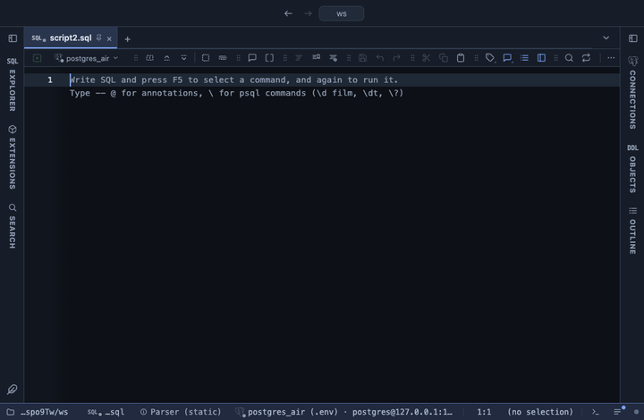

# Highlight

Colours the cells of the columns you pick that meet a condition, right in the result grid: delays above 30 minutes in red, a status that contains "cancel" in amber, a date between two days in green. A spreadsheet's Highlight Cells Rules, without writing a rule.

## What it shows

The result itself, with the matching cells coloured and the rest left as they were. The colour is a fill behind the value, the text in the colour, or bold text in it. A theme colour (red, amber, green, accent, violet) is the theme's own, so a theme extension repaints it; Custom picks any colour, which stays as picked. Hover a coloured cell to see the condition it met.

Numbers compare as numbers. Dates and timestamps compare as they read (`2026-09-01`, `2026-09-01 10:00`), and text compares as text. **contains** and **starts with** ignore case. **between** includes both ends. A NULL meets only **is empty**.

## Inputs

| Input | `@inputs` key | Default | Meaning |
|---|---|---|---|
| Columns | `columns` | asked | The columns whose cells are checked; one or several, comma separated |
| Highlight when | `when` | greater than | greater than, less than, between, equal to, not equal to, contains, starts with, is empty, is not empty |
| Value | `value` | none | What a cell is compared with: a number, a date as 2026-09-01, or text |
| And (for between) | `and` | none | The upper end for between |
| Colour | `colour` | red | A theme colour (red, amber, green, accent, violet), picked from swatches, or any colour as #rrggbb |
| Style | `style` | fill | fill, text or bold text |

## Requirements

PostgreSQL 13 or newer, and PlumeSQL 0.22.0 or newer, the first release whose formatting rules take inputs. No server side: the rule runs over the rows the grid shows.

## Notes

From a script: `-- @extension highlight` above the query, and `-- @inputs columns=delay_min, when=greater than, value=30` to answer it in the file. Without that line PlumeSQL asks for the columns the first time the query runs. **Configure Highlight…** in the result's menu changes the answers at any time, and **Save in the script** writes them as that line.

One rule, one condition. For a second condition on the same query, copy the extension to My Extensions under another id. A picked column wears the highlight instead of any other formatter that matched it (a currency format, say).

For colour scales, data bars, icon sets, top N or duplicates, which compare a cell with the rest of its column, use **Conditional format**: it opens a tab with the coloured copy.
