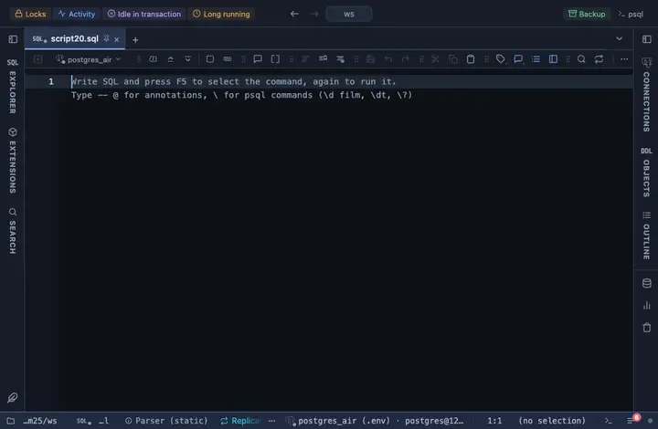

# JSON

A json or jsonb column reads compact on one line, the pretty-printed value on hover.

## What it shows

A formatting rule that matches every json and jsonb column by type. Whitespace is collapsed and the line cut at 120 characters; the whole value, pretty-printed, is in the tooltip. What the server sent stays the value: copying, exporting and the console never see the formatted text.

## Requirements

PostgreSQL 13 or newer. The rule works on the result in the grid; the server is never asked.

## Notes

A script attaches it with `-- @extension json` above the query, or once in the header for the whole file; a result's menu can attach it too. The extension's page lists the exact lines. Both the column pattern and the wording sit at the top of the file; Fork in the row menu gives you a copy to adjust.
