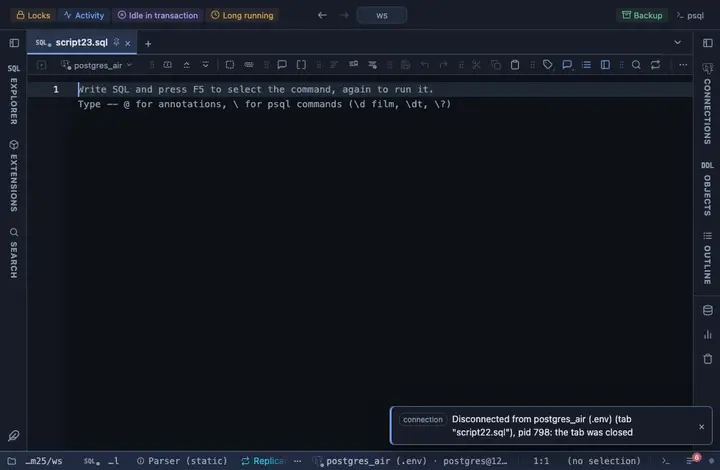

# Negatives

Every number column reads right aligned, and a negative value in red, so a balance, a delta or a margin that went under zero jumps out.

## What it shows

A formatting rule that matches the whole number family by type, any precision.  The formatting is a reading of the cell, not a change to it, so copy, export and the console keep the raw value.

## Requirements

PostgreSQL 13 or newer. No server side at all: the grid applies the rule to what it already has.

## Notes

Write `-- @extension negatives` above a query, or in the file header for all of them, or attach it from the result's menu; the page in PlumeSQL has the lines ready to copy. To match other columns or say it differently, fork it from the row menu and edit the pattern and the words in the file.
