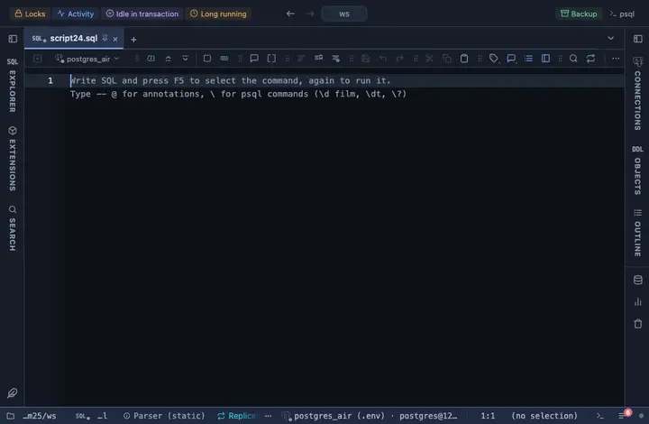

# Nulls

Every NULL cell reads as a dimmed ∅ and an empty string as a dimmed (empty), in every column, since SQL tells the two apart and a blank cell hides which one it is.

## What it shows

A formatting rule that matches every column (the name pattern `/.*/`). Any other value is untouched. The raw value is untouched: copy, export and the console still take what the server sent.

## Requirements

PostgreSQL 13 or newer. Nothing on the server: the rule runs in the grid.

## Notes

Attach it from a script with `-- @extension nulls` above a query (or in the file header for every query), or from a result's own menu; the extension's page in PlumeSQL lists the lines to paste. The file is short and the pattern and words are the first thing in it: Fork (row menu) and change them to taste.
