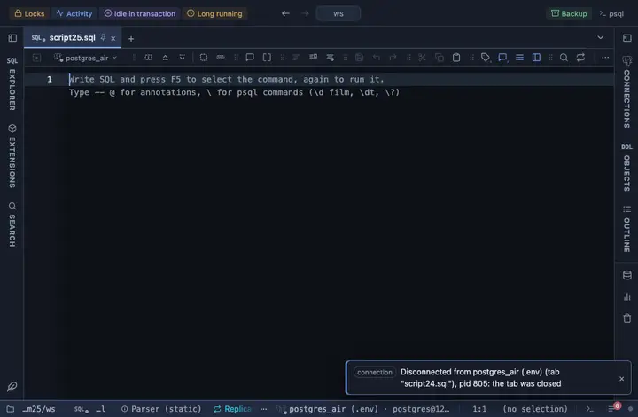

# Numbers

Every number column reads with thousands separators, any type or precision, right aligned.

## What it shows

A formatting rule that matches the whole number family by type. The separators follow the viewer's locale (`1,234,567`). Only the cell changes; a copy, an export and the console still carry the server's own text.

## Requirements

PostgreSQL 13 or newer. Runs in the grid alone, nothing is sent to the server.

## Notes

To use it, put `-- @extension numbers` above a query (in the file header it covers every query in the file) or pick it from a result's own menu. The lines to paste are on the extension's page. The pattern and the words are in the file: fork it (the row menu's Fork) to change them to your own vocabulary.
