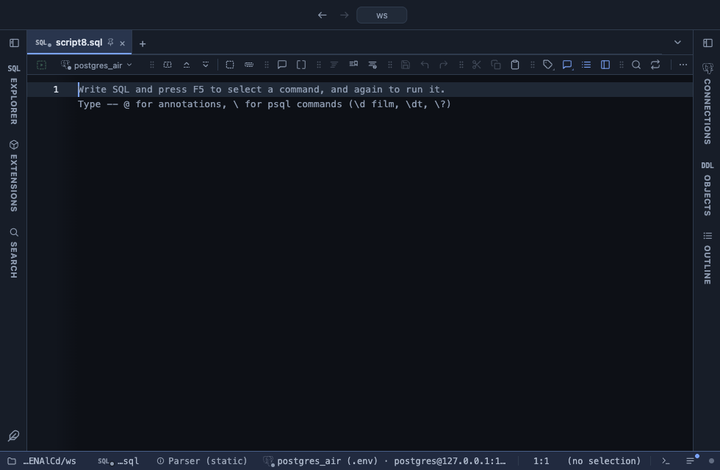

# Numbers

Every number column reads your way: thousands separators, a fixed number of decimals, negatives in red or in parentheses.

## What it shows

A formatting rule over the whole number family, matched by type, right aligned. The separators follow the viewer's locale (`1,234,567`). Only the cell changes; a copy, an export and the console still carry the server's own text, and a rounded cell keeps the exact value on hover.

## Choosing

| Input | Options | Default |
|---|---|---|
| Thousands | separated, or as sent | separated |
| Decimals | as sent, or 0 to 4 | as sent |
| Negatives | plain, in red, or in parentheses | plain |

Change them any time from the result's menu (Configure Numbers), or keep them with a script: `-- @inputs decimals=2, negatives=in red` above the query.

## Requirements

PostgreSQL 13 or newer. Runs in the grid alone, nothing is sent to the server.

## Notes

To use it, put `-- @extension numbers` above a query (in the file header it covers every query in the file) or pick it from a result's own menu. It now also does what the separate Negatives formatter did.
