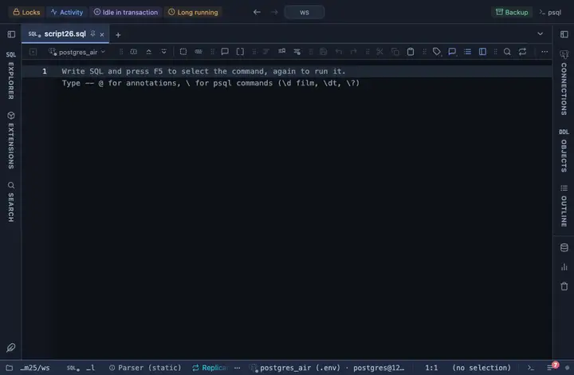

# Percent

A numeric column named *_pct, percent, ratio, rate or share reads as a percentage with a small bar behind the number.

## What it shows

A formatting rule that matches a NUMBER column whose name ends in pct, percent, percentage, ratio, rate or share (case insensitive), ANDed with a numeric type. A value between 0 and 1 is taken as a fraction (0.42 is 42 %), anything else as already in percent (42 is 42 %); the exact value is in the tooltip. What the server sent stays the value: copying, exporting and the console never see the formatted text.

## Requirements

PostgreSQL 13 or newer. The rule works on the result in the grid; the server is never asked.

## Notes

A script attaches it with `-- @extension percent` above the query, or once in the header for the whole file; a result's menu can attach it too. The extension's page lists the exact lines. Both the column pattern and the wording sit at the top of the file; Fork in the row menu gives you a copy to adjust.
