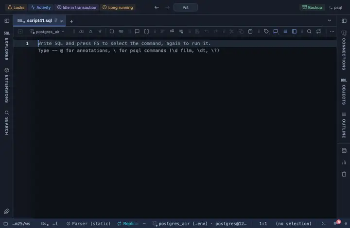

# Row numbers

Adds a leading computed column that numbers the rows, 1, 2, 3 …

## What it shows

A formatting rule that adds a column named `#` at the start. The number is the row's index in the whole result, so the count is right past the first screen. The formatting is a reading of the cell, not a change to it, so copy, export and the console keep the raw value.

## Requirements

PostgreSQL 13 or newer. No server side at all: the grid applies the rule to what it already has.

## Notes

Write `-- @extension row-numbers` above a query, or in the file header for all of them, or attach it from the result's menu; the page in PlumeSQL has the lines ready to copy. To match other columns or say it differently, fork it from the row menu and edit the pattern and the words in the file.
