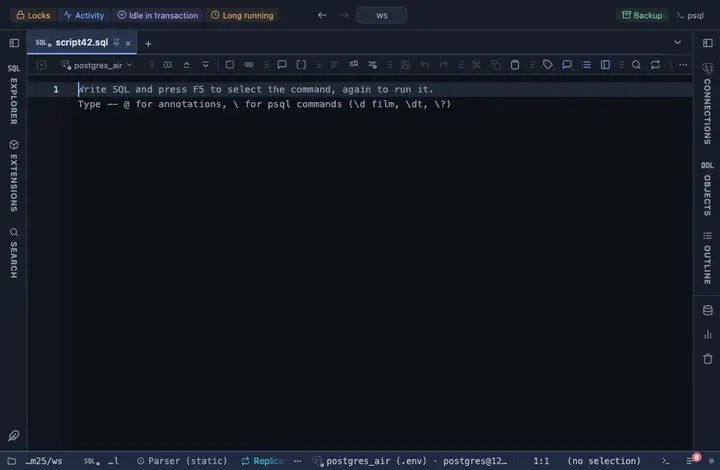

# Running total

Adds a computed column that accumulates a numeric column down the rows.

## What it shows

A formatting rule that adds a column named `running total` that adds up the `amount` column row by row, using its own previous value. The total is correct end to end on a small result; on a large one it resets per block as you scroll, so for a true cumulative use SQL (a window function). The raw value is untouched: copy, export and the console still take what the server sent.

## Requirements

PostgreSQL 13 or newer. Nothing on the server: the rule runs in the grid.

## Notes

Attach it from a script with `-- @extension running-total` above a query (or in the file header for every query), or from a result's own menu; the extension's page in PlumeSQL lists the lines to paste. The file is short and the pattern and words are the first thing in it: Fork (row menu) and change them to taste. Edit `amount` in the file to your column.
