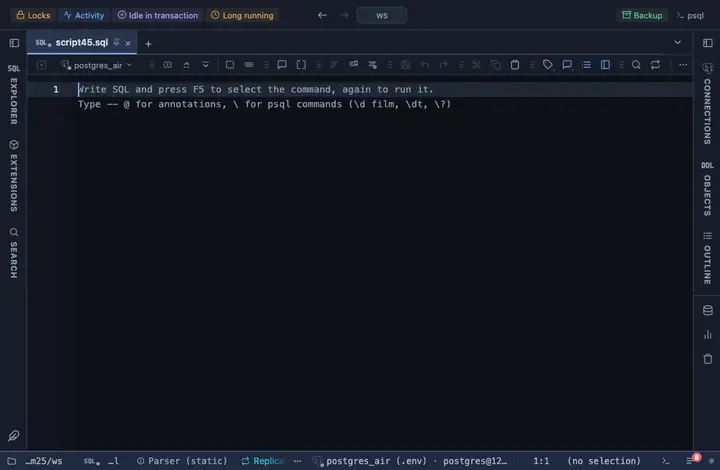

# Short UUID

A uuid column shows its first 8 characters in a monospace face, the whole id on hover.

## What it shows

A formatting rule that matches every uuid column by type. The first block is enough to tell rows apart by eye; the whole id is in the tooltip, and copy and export take the full value. Only the cell changes; a copy, an export and the console still carry the server's own text.

## Requirements

PostgreSQL 13 or newer. Runs in the grid alone, nothing is sent to the server.

## Notes

To use it, put `-- @extension short-uuid` above a query (in the file header it covers every query in the file) or pick it from a result's own menu. The lines to paste are on the extension's page. The pattern and the words are in the file: fork it (the row menu's Fork) to change them to your own vocabulary.
