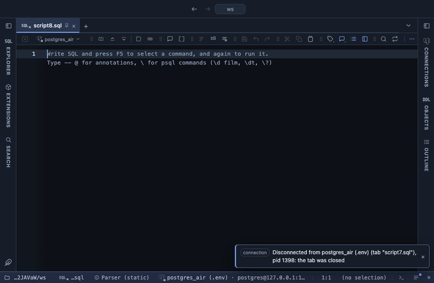

# Sparklines



A numeric array column reads as a small line chart of its items, with the count beside it and the min and max on hover.

## What it shows

A formatting rule that matches a column of a numeric array type: `integer[]`, `bigint[]`, `numeric[]`, `real[]`, `double precision[]` and the like. Each cell draws its items left to right as a line 80 by 18 pixels, with a dot on the last one, in the cell's text colour so it reads in every theme. A NULL item is skipped, an empty array reads as the array text greyed out. The hover says how many items there are, the smallest, the largest and the last. The value is untouched: copy, export and the console still take the array text.

An array comes from `array_agg` with an order, one row per series:

```sql
select product, array_agg((random() * 100)::int order by day) as daily_units
from pg_catalog.generate_series(1, 30) as day
cross join (values ('apples'), ('pears')) as p(product)
group by product;
```

## Requirements

PostgreSQL 13 or newer. Nothing on the server: the rule runs in the grid.

## Notes

Attach it from a script with `-- @extension sparklines` above a query (or in the file header for every query), or from a result's own menu; the extension's page in PlumeSQL lists the lines to paste. The line is scaled per cell, from its own min to its own max, so two rows compare in shape, not in size; the hover gives the numbers. An array longer than 40 items is averaged into 40 points, so the line keeps its shape in 80 pixels; the hover still gives the real min, max and last.
