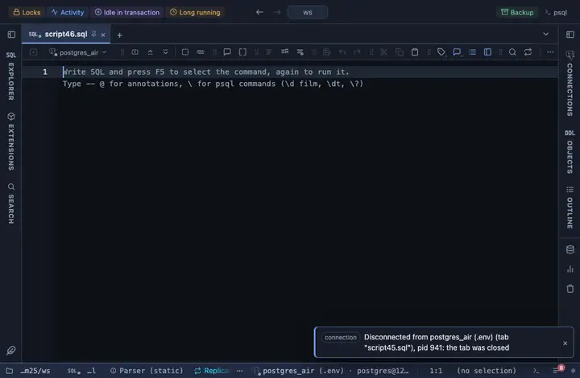

# Status

A column named *status reads green, amber or red by its value.

## What it shows

A formatting rule that matches a column whose name ends in status (status, order_status, payment_status); the match stays on the NAME, because a status is often an enum or text. active, done, success, ok, completed, enabled and paid read green; error, failed, cancelled, disabled and rejected red; pending, waiting, processing, review and queued amber; anything else dimmed. What the server sent stays the value: copying, exporting and the console never see the formatted text.

## Requirements

PostgreSQL 13 or newer. The rule works on the result in the grid; the server is never asked.

## Notes

A script attaches it with `-- @extension status` above the query, or once in the header for the whole file; a result's menu can attach it too. The extension's page lists the exact lines. Both the column pattern and the wording sit at the top of the file; Fork in the row menu gives you a copy to adjust.
