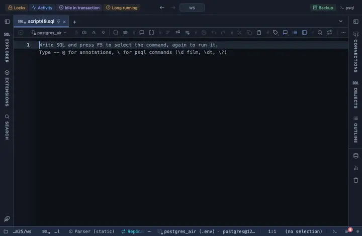

# Trend

Every number column shows an up or down arrow, green or red, against the row above.

## What it shows

A formatting rule that matches the whole number family by type and compares each value with the same column one row up. Sort the query so the rows read in the order the trend should follow, by time say; an unchanged value shows no arrow. The formatting is a reading of the cell, not a change to it, so copy, export and the console keep the raw value.

## Requirements

PostgreSQL 13 or newer. No server side at all: the grid applies the rule to what it already has.

## Notes

Write `-- @extension trend` above a query, or in the file header for all of them, or attach it from the result's menu; the page in PlumeSQL has the lines ready to copy. To match other columns or say it differently, fork it from the row menu and edit the pattern and the words in the file.
