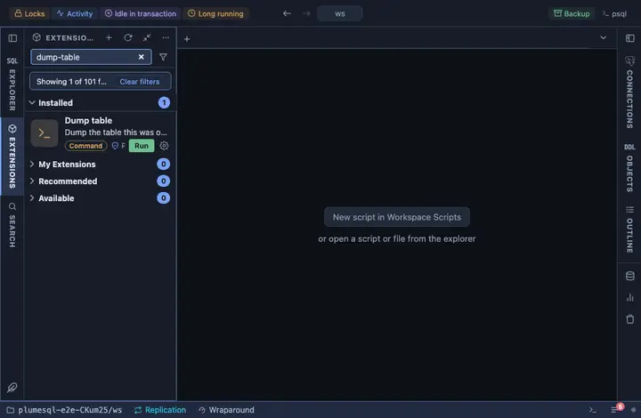

# Dump table

Dump one table, definition and rows, into a plain SQL file named after
it, from the table's own row in the object tree. The quick copy of one
table before you touch it, or the way to carry it to another database.

## What it does

An `@for table` extension: it appears in the Actions submenu of every
table's row in the object tree and on an open table's header, and runs
`pg_dump --table=<the table> --file=<name>-<date>.sql` on the tab's
connection, in a terminal of its own. The terminal shows pg_dump's own
output; when it finishes the file opens.

## Inputs

| Input | Default | Meaning |
|---|---|---|
| dump | `{name}-{date}.sql` | The file's name in the workspace, declared once so the question, the command and the opened file cannot disagree. |

The password never appears in the command line: it reaches pg_dump
through the environment (`@env PGPASSWORD={password}`).

## Requirements

`pg_dump` on this machine, at a version not older than the server's:
PlumeSQL finds every PostgreSQL client installation (System, Client
tools, which also installs a missing one) and runs the one that suits
the server, so nothing has to be on the PATH. A connection whose user may
read the table. PostgreSQL 13 or newer.

## Notes

A command extension: it runs a program on your machine, not a query on
the server. It asks before it runs (`@confirm`) and writes into the
WORKSPACE directory, beside your files; move or ignore the file as you
would any generated one. Plain SQL format: readable, and restorable with
`psql`.
