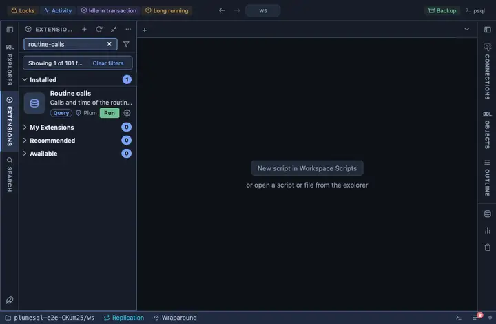

# Routine calls

How often the routine this was opened on has been called and how long
it took, for every overload of its name, with its language, volatility
and security mode. From a function's or procedure's row in the object
tree.

## What it shows

One row per routine of that name in that schema (overloads are separate
rows):

| Column | Meaning |
|---|---|
| routine | The signature, as `regprocedure` prints it. |
| language | plpgsql, sql, c, and so on. |
| volatility | immutable, stable or volatile, which decides how the planner may cache it. |
| security | definer or invoker. |
| calls | How many times it was called since the statistics were reset. |
| total_ms, self_ms | Total time, and time inside the routine itself excluding what it called. |

## Requirements

PostgreSQL 13 or newer. The counters need `track_functions = pl` (or
`all`) in postgresql.conf or set in the session; without it the calls
column is empty and the rest still describes the routine.

## Notes

Reads only. An `@for routine` extension: `{schema}` and `{name}` are the
routine it was opened on, bound as parameters.
