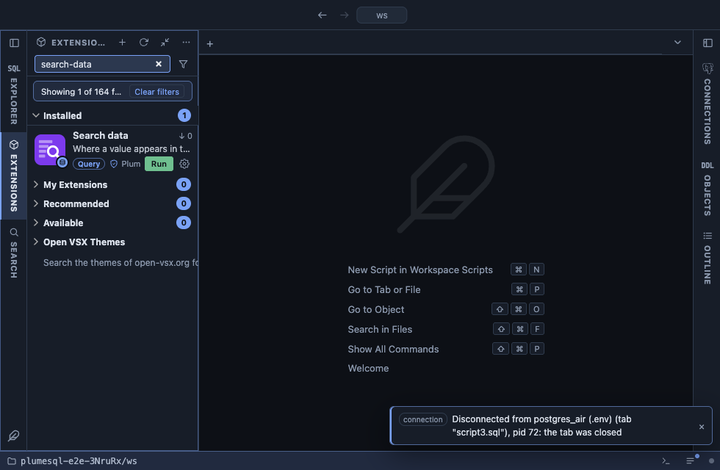

# Search data

Where a value appears in the data: every text column of every table that
holds it, with a count and a sample. Reach for it when you have an email,
an order number or a name and no idea which table it lives in.

## What it shows

One row per column that holds the term, the columns with the most hits
first:

| Column | Meaning |
|---|---|
| schema, table, column | Where the term was found. |
| type | The column's type. |
| matches | How many rows hold it, counted up to the limit you set. Click it to open those rows. |
| note | `counted up to N` when there may be more than the limit. |
| sample | One matching value, cut to 200 characters. |
| query | The `SELECT` that lists the matching rows, ready to copy into a script. |

Tables larger than the size limit are not searched; each gets one row at
the end saying so, with its size.

What is searched: every column of a text type (`text`, `varchar`, `char`,
`citext`, a domain over one of them), every enum, `uuid`, `json` and
`jsonb` (as their text), in every table, partitioned table and
materialized view you may read. When the term is a number, integer,
`numeric` and floating point columns are searched too, compared as
numbers, so `42` finds `42` and not `142`.

## Inputs

| Input | Default | Meaning |
|---|---|---|
| Search for | | The term. Case is ignored, and `%` and `_` in it are plain characters. |
| Schema | `*` | One schema, or `*` for every schema you can read. The list shows each schema with its number of tables. |
| Match | contains | `contains` finds the term anywhere in the value, `starts with` at its start, `exact` only the whole value. |
| Count up to | 1000 | Rows counted per column. A lower number makes the search faster on big tables. |
| Skip tables larger than (MB) | 1024 | Tables above this size are listed as not searched rather than read. |

## Requirements

PostgreSQL 13 or newer. It searches only the columns you may select; the
rest are left out without an error. Each column is read through
`query_to_xml`, which needs a server built with XML support, as every
common distribution is.

## Notes

Reads only. The search reads every searched column of every table up to
the count limit, with no index to help (`ILIKE '%term%'` cannot use one),
so on a large database pick a schema, keep the size limit, and expect it
to take a while. It runs as one statement on your connection: Cancel
stops it.

Opening a match lists the rows of that table whose column holds the term,
as many as were counted. It selects every column, so a role allowed to
read only some columns of the table finds the match here but cannot open
it; copy the `query` column and narrow it instead.

What you type never goes into the SQL text as it is: the server quotes
it (`format('%L')`) before a statement is built from it, and table and
column names are quoted as identifiers.
