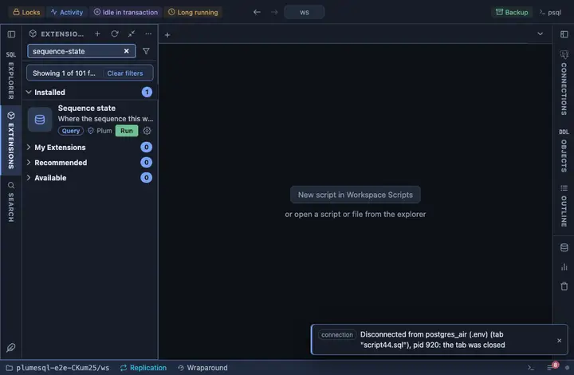

# Sequence state

Where the sequence this was opened on stands: its last value, range and
step, and how much of the range is left before it runs out or cycles.
From a sequence's row in the object tree; the question to ask of an
`integer` primary key that has been growing for years.

## What it shows

One row for the sequence:

| Column | Meaning |
|---|---|
| last_value | The last value handed out (empty when none has been). |
| start_value, increment_by | Where it started and the step. |
| min_value, max_value | The range. |
| percent_left | How much of the range remains, from the last value to the maximum. |
| cycle | Whether it wraps around at the end instead of failing. |
| type | smallint, integer or bigint. |

## Requirements

PostgreSQL 13 or newer. Reading `last_value` needs SELECT or USAGE on
the sequence.

## Notes

Reads only. An `@for sequence` extension: `{schema}` and `{name}` are the
sequence it was opened on, bound as parameters. A sequence near the end
of an `integer` range is changed with `ALTER SEQUENCE … AS bigint` and
the column's type alongside.
