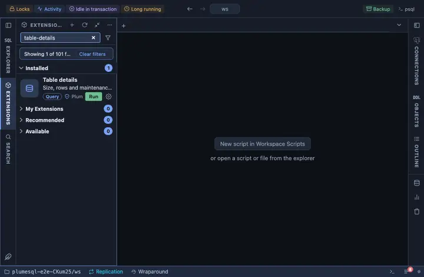

# Table details

Size, rows and maintenance state of the table this was opened on: how
big it is on disk, heap and indexes apart, how many rows live and dead,
how it is read, and when vacuum and analyze last ran. From a table's row
in the object tree, and from every result's header for the tables the
query reads.

## What it shows

One row for the table or materialized view:

| Column | Meaning |
|---|---|
| total_size, heap_size, indexes_size | On disk, all in, the rows alone, the indexes alone. |
| estimated_rows | The planner's row estimate (`reltuples`). |
| live_rows, dead_rows | Rows the statistics see as live, and dead ones waiting for vacuum. |
| sequential_scans, index_scans | How the table is read. |
| last_vacuum, last_autovacuum | When it was last vacuumed by hand and by autovacuum. |
| last_analyze, last_autoanalyze | When its statistics were last refreshed. |

## Requirements

PostgreSQL 13 or newer.

## Notes

Reads only. An `@for table, materialized view` extension: `{schema}` and
`{name}` are the object it was opened on, bound as parameters. Pinned to
every result's header too (`@toolbar results`): there it is offered for
the tables the result's statement reads, one click on one table or a
pick among several, the fastest way to a table you are writing a query
against.
