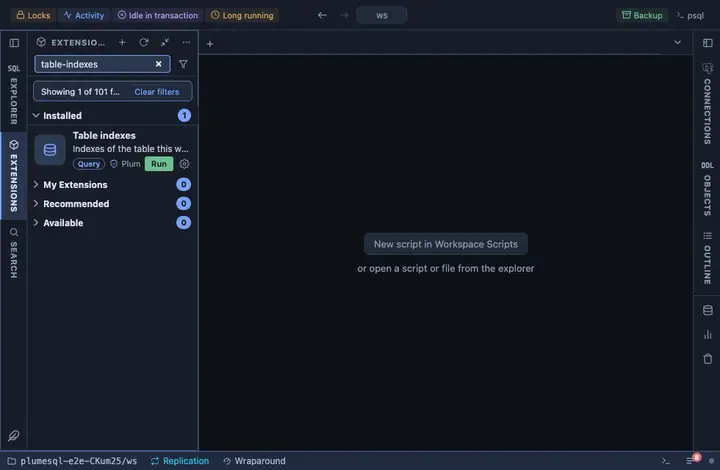

# Table indexes

The indexes of the table this was opened on: each one's definition,
size and how often it is read, with the ones never read marked. From a
table's row in the object tree, and from every result's header for the
tables the query reads, so the indexes behind a query you are writing
are one click away.

## What it shows

One row per index, primary key first, then unique ones, then by reads:

| Column | Meaning |
|---|---|
| index | Its name. |
| definition | The CREATE INDEX statement. |
| size | On disk. |
| scans | How many index scans used it since the statistics were reset. |
| tuples_read, tuples_fetched | Index entries read, and table rows fetched through it. |
| primary, unique, valid | Its flags; an invalid index is one a failed CONCURRENTLY build left behind. |
| note | `never read` for an index with no scans that is neither unique nor primary, the same question Unused indexes asks of the whole server. |

## Requirements

PostgreSQL 13 or newer.

## Notes

Reads only. An `@for table, materialized view` extension: `{schema}` and
`{name}` are the object it was opened on, bound as parameters. The
statistics come from `pg_stat_all_indexes`, so system tables answer too.
Pinned to every result's header (`@toolbar results`) beside Table
details.
