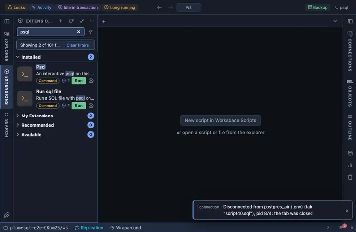

# psql

An interactive psql on the tab's connection, in a terminal inside
PlumeSQL, one click from the title bar. For the moments the command line
is the right tool: a meta-command, a `\copy`, a script you already
know by heart.

## What it does

Runs `psql` against the tab's connection (host, port, user, database) in
a terminal of its own. The password travels through the environment, so
it is never in the command line, the terminal or a shell history; psql
is asked not to prompt for one (`--no-password`), so with no password to
hand it says so rather than sit waiting.

## Requirements

`psql` on this machine: PlumeSQL finds every PostgreSQL client installation (System, Client tools, which also installs a missing one) and runs the one that suits the server, so nothing has to be on the PATH. PostgreSQL 13 or newer.

## Notes

A command extension: it runs a program on your machine. Pinned at the
title bar's right end (`@toolbar end`). The terminal is PlumeSQL's own;
`\q` ends the session and the tab keeps the transcript.
