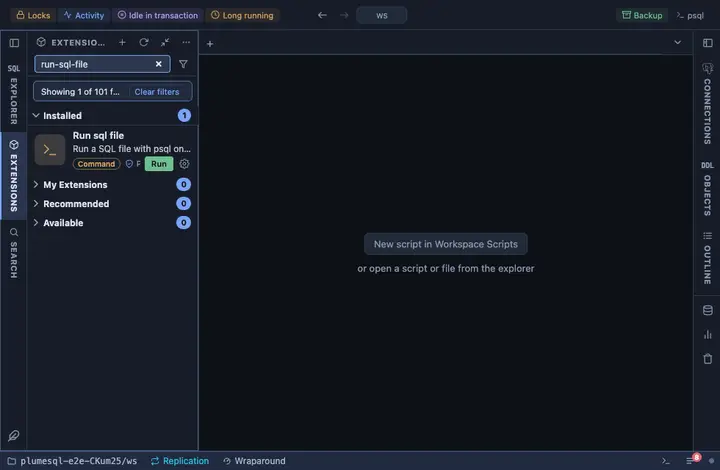

# Run SQL file

Run a SQL file from the workspace with psql on the tab's connection,
statement by statement, as written, stopping at the first error. The
way to apply a migration or a seed script exactly as the command line
would, without leaving PlumeSQL.

## What it does

Asks which file to run (the workspace's files, newest first), confirms,
then runs `psql --file` on the tab's connection in a terminal of its
own, with `--set ON_ERROR_STOP=1`, which stops at the first error instead
of carrying on, and `--echo-errors`, which prints the failing statement
beside its error, so the terminal is the whole account.

## Inputs

| Input | Default | Meaning |
|---|---|---|
| script | asked | The SQL file to run, picked from the workspace. |

The password reaches psql through the environment (`@env
PGPASSWORD={password}`), never the command line.

## Requirements

`psql` on this machine: PlumeSQL finds every PostgreSQL client installation (System, Client tools, which also installs a missing one) and runs the one that suits the server, so nothing has to be on the PATH. PostgreSQL 13 or newer.

## Notes

A command extension: it runs a program on your machine. It asks before
it runs (`@confirm`), naming the file, the database and the host. The
file runs as psql reads it, one statement after another; wrap it in
`begin` and `commit` yourself when every statement must land together.
