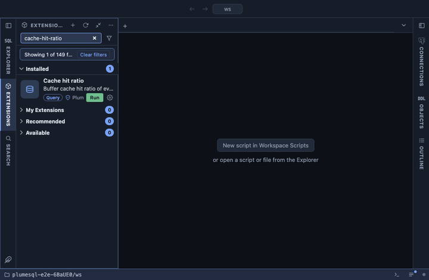

# Cache hit ratio

The buffer cache hit ratio of every database on the server, then of
each table and index of this one, the lowest first. A hit is a block
found in PostgreSQL's shared buffers; a read is a block asked of the
operating system, which may still have it in its own cache or may go to
the disk. A busy OLTP database usually sits above 99 %; a table or an
index far below that is where the reads go.

## What it shows

Databases first, then tables, then indexes, each group lowest ratio
first:

| Column | Meaning |
|---|---|
| kind | `database`, `table` or `index`. |
| name | The database, the schema qualified table, or the index with its table. |
| hit % | Hits as a share of hits and reads. |
| hits, reads | The block counters. A table's include its TOAST blocks; its indexes have rows of their own. |
| read from outside | The reads as a size: what went past shared buffers. |

Objects nobody has read since the statistics were reset are left out.

## Requirements

PostgreSQL 13 or newer. The counters come from `pg_stat_database`,
`pg_statio_user_tables` and `pg_statio_user_indexes`, since the last
statistics reset or the last restart. Tables and indexes are this
database's only; PostgreSQL keeps those statistics per database.

## Notes

Reads only. A low ratio on a large table that is scanned whole (a
report, a sequential scan by design) is expected and not a problem; a
low ratio on a small, hot table or index is. The ratio says nothing
about the operating system's cache, so a low figure with fast queries
often means the OS cache is doing the work.
