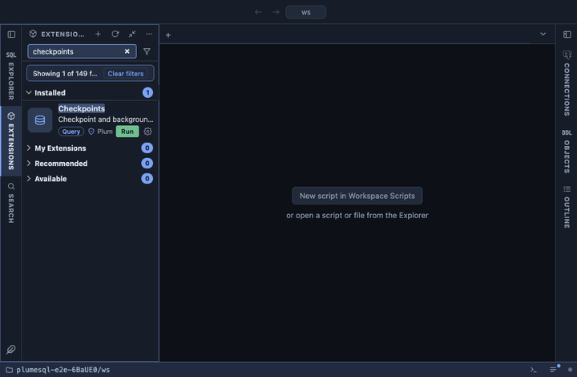

# Checkpoints

Checkpoint and background writer statistics as a short list of figures
with a note beside each: how many checkpoints came on time and how many
were forced, how long they spent writing and syncing, and who wrote the
dirty buffers. Forced checkpoints and backends writing their own
buffers are the two signs that the WAL and write settings are too
tight for the load.

## What it shows

| Metric | Meaning |
|---|---|
| timed checkpoints | Started because `checkpoint_timeout` passed, as they should be. |
| requested checkpoints | Forced: `max_wal_size` filled up, or a CHECKPOINT command, a base backup, a restart. |
| requested share | The forced share, with a note when it is the majority. |
| write time, sync time | Total seconds spent writing and syncing, and the average per checkpoint. A long sync means the storage cannot absorb the writes. |
| buffers written by checkpoints | Dirty buffers the checkpointer wrote. |
| buffers written by the background writer | Written ahead of need by the background writer. |
| buffers written by backends | Written by the backends themselves, which wait for it (up to PostgreSQL 16; from 17 see I/O statistics). |
| background writer stopped at its limit | Rounds that hit `bgwriter_lru_maxpages`. |
| buffers allocated | Buffers allocated in total. |
| counting since | When the counters were last reset. |

## Requirements

PostgreSQL 13 or newer, one query for every version. PostgreSQL 17
moved the checkpoint counters out of `pg_stat_bgwriter` into the new
`pg_stat_checkpointer` and dropped the backend write counter; the query
reads `pg_stat_checkpointer` where it exists (through `query_to_xml`,
since a query cannot name a view the server does not have) and
`pg_stat_bgwriter` otherwise. On 17 and newer that needs a server
built with XML support, which every common distribution is.

## Notes

Reads only. The counters run since the last reset or restart; on a
server that restarted recently the figures are small and the ratios say
little.
