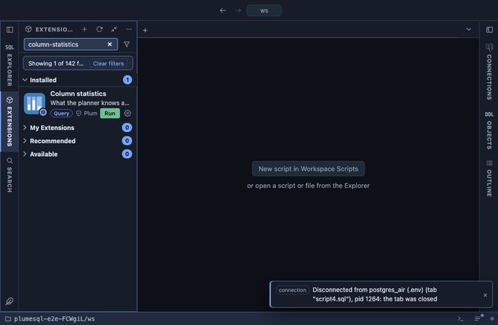

# Column statistics

What the planner knows about each column of the table this was opened
on: how many nulls, how many distinct values, how closely the physical
order follows the sorted one, the most common values and the spread of
the rest. Read from `pg_stats`, the statistics ANALYZE collected, so it
never scans the table and answers at once on a table of any size. From
a table's row in the object tree, and from every result's header for
the tables the query reads.

## What it shows

One row per column, in table order:

| Column | Meaning |
|---|---|
| column, type | The column and its type. |
| null_pct | Share of rows where it is null. |
| distinct | Estimated number of distinct values, with that as a share of the rows (`5,461 (0.8% of rows)`); `unknown` when ANALYZE could not tell. |
| correlation | From -1 to 1, how closely the order on disk follows the column's sorted order; near 1 or -1 makes an index range scan cheap. |
| avg_width | Average size of a value in bytes. |
| most_common | Up to five most common values with their share of the rows (`ATL 2.3%, ORD 1.8%`), each cut to 40 characters. |
| histogram_min, histogram_median, histogram_max | The first, middle and last histogram bounds: the spread of the values that are not among the most common. |
| analyzed | When the table's statistics were last refreshed, by hand or by autovacuum. |
| note | `never analyzed` when the table has no statistics yet, `no statistics for this column` when ANALYZE skipped it. |

## Requirements

PostgreSQL 13 or newer. Rows appear only for the columns you can read:
`pg_stats` hides the others.

## Notes

Reads only, and reads no rows of the table. An `@for table, materialized
view` extension: `{schema}` and `{name}` are the object it was opened
on, bound as parameters. Pinned to every result's header too
(`@toolbar results`). The numbers are estimates from a sample, as fresh
as the last ANALYZE; when they look off, `analyze <table>` refreshes
them. For a partitioned table the statistics cover the whole tree.
