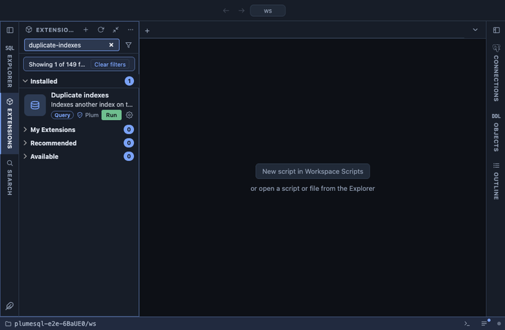

# Duplicate indexes

Indexes that another index on the same table already covers, the
largest first, each beside the index that covers it and with the
statement that would drop it. A redundant index costs disk, memory and
time on every write to its table and serves no query the other one
could not.

## What it shows

One row per redundant index:

| Column | Meaning |
|---|---|
| schema, table | The table both indexes belong to. |
| redundant index, size | The index that can go, and what it takes on disk. |
| because it is | `duplicate of`: the same key columns and INCLUDE columns; `left prefix of`: its keys are the first keys of a longer btree index; `covered by`: the same keys, where the other adds INCLUDE columns. |
| covering index | The index that stays. |
| redundant definition, covering definition | Both CREATE INDEX statements, to compare. |
| drop statement | `DROP INDEX CONCURRENTLY` for a plain index, `ALTER TABLE ... DROP CONSTRAINT` for one that backs a constraint. Text only: the query never runs it. |

## What counts as the same

Two indexes are compared only on the same table, with the same access
method and the same predicate (a partial index is compared only with
indexes of the same WHERE clause). Their key columns are compared in
order, each with its expression, operator class, collation and sort
options, so `(a)` and `(a DESC)`, or `(c)` and `(c COLLATE "C")`, are
not duplicates. Invalid indexes (a failed CONCURRENTLY build) are left
out.

Of two exact duplicates, the one that stays is the one backing a
constraint, then a unique one, then the older one. A left prefix is
reported only for btree, and never when the shorter index is unique,
backs a constraint or carries INCLUDE columns of its own: those do
something the longer index cannot.

## Requirements

PostgreSQL 13 or newer. User schemas only; the system catalogs are left
out.

## Notes

Reads only. Drop one row at a time and read the list again: when three
indexes overlap, the covering index of one row can itself be listed as
redundant against a third. A left prefix is redundant for searches, but
the shorter index is smaller and can be the faster one to scan; check
the index statistics (Unused indexes, Table indexes) before dropping a
busy one. `DROP INDEX CONCURRENTLY` cannot run inside a transaction
block.
