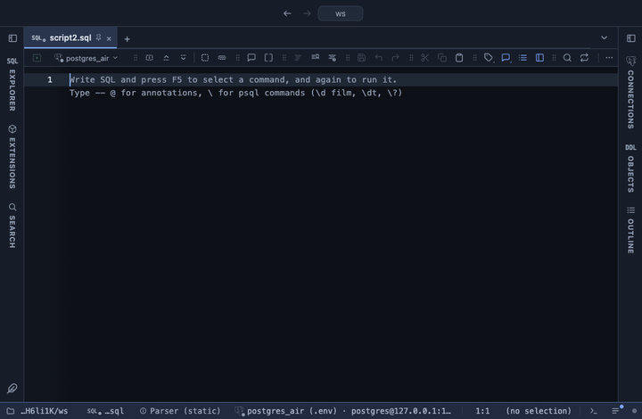

# Explain plan

The plan of an EXPLAIN as a picture you can read: where the time goes, what was misestimated, what spilled, step by step. It opens by itself on every EXPLAIN result, JSON or text, with nothing to configure.

## What it shows

A **Plan** tab beside the grid, in four parts:

- **The summary**: execution and planning time (or the total cost of a plain EXPLAIN), rows returned, buffers read and how much of them came from the cache, the number of steps, and JIT time when there was any.
- **What stands out**: the facts worth a look first, each one a link to its step. A step that takes a fifth of the time or more, row estimates off by ten times or more, a filter that discarded nearly everything it read, a sort or a hash that spilled to disk, temporary files, an inner side run thousands of times in a nested loop, heap fetches in an index only scan and a bitmap gone lossy. Only what the plan's own numbers say; nothing is guessed.
- **Where it goes**: an icicle graph of the whole plan, each step a box as wide as its share, under its parent, coloured by its own share. Switch what it measures between Time, Rows, Cost and Buffers.
- **Steps**: the plan as a tree table, each step with its own time (or cost, or buffers) as a bar, its time in all, its rows with the misestimate beside them, its loops and its notes. Select a step to read everything the plan says about it on the side: its conditions, sort keys, memory, buffers and every other property.

A step's own time is its time in all less its children's, and its time in all counts every loop, except under a Gather, where the loops are the workers running side by side.

## Using it

Run EXPLAIN, the editor's **Explain ▾** lens or the run glyph's right click on any statement. The lens speaks PostgreSQL's default text form (its last variant asks for JSON), and EXPLAIN ANALYZE of a statement that writes runs inside a rollback. Any EXPLAIN typed by hand works too, in JSON or in text, with or without ANALYZE and BUFFERS; the more the plan carries, the more the view shows.

## Keyboard

In the Steps table, Up and Down walk the steps, Left folds a step or goes to its parent, Right unfolds it or goes to its first child, Home and End go to the first and the last. Enter on a fact goes to its step.

## Actions

**Copy plan** copies the plan as it came from the server, **Copy summary** a short text of the totals and what stands out, ready for a ticket.

## Requirements

PostgreSQL 13 or newer. No server side: it reads the plan already fetched. It installs with **stats-core**, the shared helper library of the Analysis extensions, and applies everywhere from the install on (a global scope you can change on its page).
