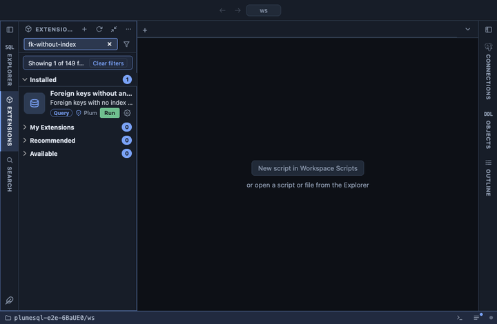

# Foreign keys without an index

Foreign keys whose referencing columns no index leads with, the largest
table first, with the statement that adds one. PostgreSQL indexes the
referenced side of a foreign key (it must be unique) but never the
referencing side, so a DELETE or a key UPDATE on the parent scans the
whole child table for every row it touches, and a join from parent to
child has nothing to use.

## What it shows

One row per uncovered foreign key:

| Column | Meaning |
|---|---|
| schema, table | The referencing table. |
| foreign key | The constraint's name. |
| columns | Its referencing columns, in the constraint's order. |
| references | The referenced table. |
| on delete | What a delete on the parent does here; `cascade` and `set null` make the missing index cost even more. |
| table size, rows (est.) | The referencing table's total size and estimated rows: the scan each parent delete pays. |
| create statement | The CREATE INDEX to add, `CONCURRENTLY` except on a partitioned table (which cannot build one that way). Text only: the query never runs it. |

## What counts as covered

A foreign key is covered when a valid index on the referencing table,
without a WHERE clause, has exactly the foreign key's columns as its
leading key columns, in any order. An index that has them further
along, or a partial index, does not count. On a partitioned table the
foreign key is reported once, on the partitioned table itself.

## Requirements

PostgreSQL 13 or newer. User schemas only.

## Notes

Reads only. A small child table, or a parent that is never deleted from
or updated, may not need the index; the size column says which ones
matter. `CREATE INDEX CONCURRENTLY` cannot run inside a transaction
block.
