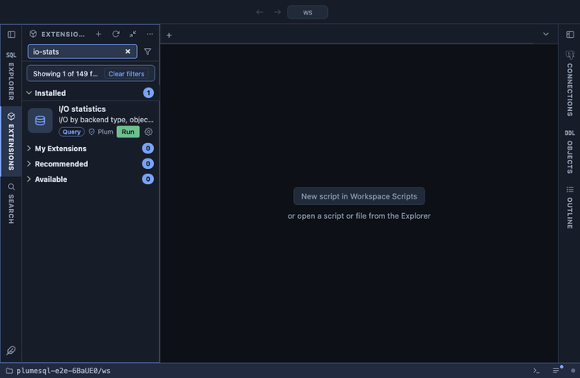

# I/O statistics

The server's I/O by backend type, object and context from `pg_stat_io`:
how many blocks each kind of process read, wrote, extended and found in
the cache, and how long the reads, writes and fsyncs took. It answers
who does the I/O: client backends, autovacuum, the checkpointer, the
background writer.

## What it shows

One row per backend type, object and context that did any I/O, the most
I/O time first (then the most operations):

| Column | Meaning |
|---|---|
| backend type | `client backend`, `autovacuum worker`, `checkpointer`, `background writer`, ... |
| object | `relation`, `temp relation`, and from PostgreSQL 18 `wal`. |
| context | `normal`, `vacuum`, `bulkread`, `bulkwrite`, and from 18 `init` for WAL. |
| reads, read, read ms | Read operations, their size, and their time. |
| hits, hit % | Blocks found in shared buffers, and their share of hits and reads. |
| writes, written, write ms | Write operations, their size, and their time. A client backend writing much of its own data is waiting for it; the background writer and the checkpointer should do that. |
| extends | Operations that grew a relation. |
| evictions, reuses | Buffers pushed out to make room, and ring buffers reused (bulk and vacuum contexts). |
| writebacks, fsyncs, fsync ms | Requests to the kernel to write back, fsync calls and their time. |
| since | When these counters were last reset. |

## Requirements

PostgreSQL 16 or newer: `pg_stat_io` does not exist before. The query
answers on 16, 17 and 18 alike: 18 replaced the per-operation `op_bytes`
with `read_bytes` and `write_bytes`, and the row is read as JSON so
both shapes give the sizes. The times stay zero unless `track_io_timing`
is on (and `track_wal_io_timing` for WAL rows on 18).

## Notes

Reads only. `select pg_stat_reset_shared('io')` resets these counters,
which makes the list a measurement of what happens from then on.
